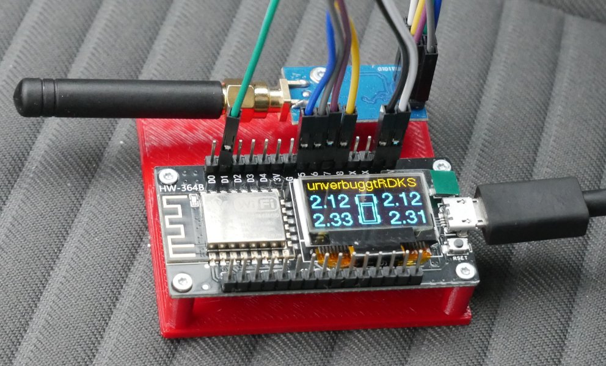

# TPMS External Tire Pressure Monitoring System 433 MHz (CC1101)

## Previous work

previous work with [tpms_truck.c](https://github.com/merbanan/rtl_433/blob/master/src/devices/tpms_truck.c)
and BLE by andi38 was moved [here](truck_ble_andi38/)

## Sensor

This currently reads the FoMoCo F2GT type TPMS [sensors](sensors/) of my winter tires and some other sensors from my other Ford car.

## Prototype

I'm using the [HW-364](https://github.com/peff74/esp8266_OLED_HW-364A/) ESP8266 Board with a CC1101 Board.

## Program

Currently it can read and display pressure from both sensor types.

TODO: implement automatic learn mode.