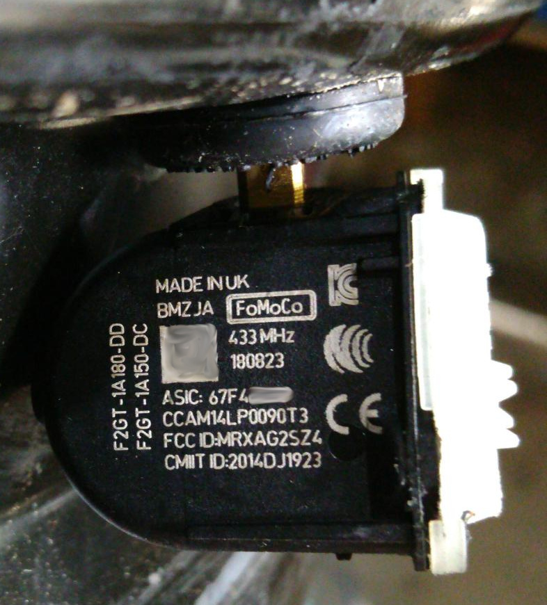

# Sensors

## Other (probably EV6T) type

It seems to be like [tpms_ford.c](https://github.com/merbanan/rtl_433/blob/master/src/devices/tpms_ford.c). But I'd disagree with the temperature offset (It is probably -65 °C, but let's wait for colder temperatures).

The total transmission is 160 bits. The transmission is OOK modulated while car is standing or when using the 125kHz trigger tool (BC2T-1A203-AB). It changes to FSK modulation while driving.

Preamble 16 Bits: `0101010101010101` = `0x5555`.  
Sync Word 16 Bits: `0101010101010110` = `0x5556`.

Eight Manchester encoded data bytes `II II II II PP TT FF CC`.

`IIIIIIII`: ID, mine started with `4` in the first nibble.

`PP`: Pressure, as PSI * 4.

`TT`: Sequence increased after every transmission, if MSB is set.

`TT`: Temperature, in °C + 65 (probably), if MSB is not set.

`FF`: Flags:  
`00001010`(0x0A) or `10001010`(0x8A): while training with trigger tool.  
`00000110`(0x06): while car standing (once every few hours).  
`01000110`(0x46) or `11000110`(0xC6): while driving.  
Bit7 (0x40) seems to indicate driving, Bit3 (0x08) indicates learning while Bit3 (0x40) is off and Bit 1 (0x02) is always on.
Maybe Bit8 (0x80) indicates a near empty battery.

`CC`: Sum of byte 0 to 6 = byte 7

Sequence counting in `TT` is transmitted every 15-16 seconds for pretty accurately for 10 minutes while driving.  
After that the telegram with temperature at `TT` is transmitted every minute.

## F2GT type

Ditto for this sensor type, but different.

`IIIIIIII`: ID, mine started with `6` in the first nibble.

`PP`: Pressure, as PSI * 4.

`TT`: Unknown sequence, while flags 0x4B.

`TT`: Temperature, in °C + 65 (probably), while flags 0x46.

`FF`: Flags:  
`00010100`(0x14): while training with trigger tool.  
`00000101`(0x05) or `00000110`(0x06): while car standing (once every few hours).  
`01001011`(0x4B): while driving and transmitting unknown sequence.  
`01000110`(0x46): while driving and transmitting temperature.  
Bit7 (0x40) seems to indicate driving, Bit4 (0x10) indicates learning.

`CC`: Sum of byte 0 to 6 = byte 7

Unknown sequence `TT` is transmitted every 17-18 seconds for pretty accurately for 7 minutes while driving.  
After that the telegram with temperature at `TT` is transmitted every minute.

